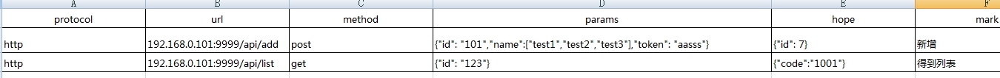
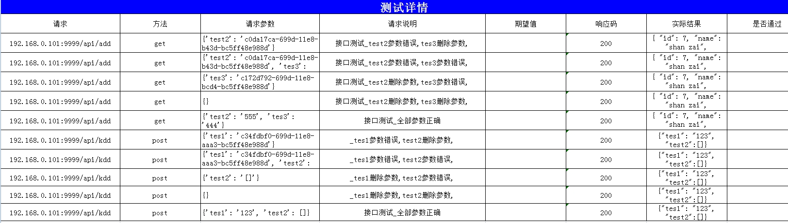
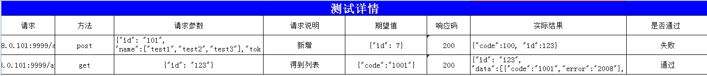

# 项目简介
基于python3的自动化接口测试

## 功能
* Win7 64，python 3，Pycharm. unittest
* excel管理用例
* 邮件发送测试结果
* 基于pict模糊测试

## 用法
### 不使用模糊测试
* 首先电脑需要配置python3.4的环境
* 点击lib目录下的install.bat安装依赖文件
* 维护Report目录下的api.xlsx写入接口测试
* 点击Runner.py的start.bat,或者python runner.py
* 查看测试报告Report目录下的report.xlsx
### 使用模糊测试
* 点击lib目录下的install_pict.bat进行依赖文件安装,会自动关闭explorer
* 打开Setting目录下的Config.ini设置为True
* 模糊测试现在只支持对每个参数的错误，删除的场景，可以自行扩展
* 模糊测试暂不支持检查点

## 报告

## 其他需要登录
接口测试需要登录返回的一系列数据，如果令牌，会议等等，打开跑垒员
经过setUpClass传递给各个接口
def get_session():
    req = requests.session()
    url = ""
    data = {}
    req.post(url, data, verify=False)
    return req

class ParametrizedTestCase(unittest.TestCase):
  

    def __init__(self, methodName='runTest', param=None):
        super(ParametrizedTestCase, self).__init__(methodName)

    @classmethod
    def setUpClass(cls):
        cls.rq = get_session() # 登录后的session
        pass
在的TestCase目录中的Api.py中接受登录后的会话，并传给BaseReq.py中进行修改

class ApiTest(ParametrizedTestCase):
    def test_api(self):
		ls = read_excel(Element.API_FILE)
		# self.req 就是得到了登录后的信息session 
	    Config().config_req(ls，self.req)

    @classmethod
    def setUpClass(cls):
        super(ApiTest, cls).setUpClass()
        

PICT生成的异常场景
在BaseParams.py中的__param_format函数生成异常场景，根据需要自行扩展
 def __param_format(self, key):
        param_type = {
            str: lambda: str(uuid.uuid1()),
            list: lambda: [],
            dict: lambda: {}
        }
        return param_type[type(key)]()
检查点说明
在启用PICT的模糊测试后，不会对检查点进行检查
现在支持的检查点为：
{"id":11,"code":2222} 检查点可以设置为： {"code":22}
{"code":1,data:[{"id": "123"}, {}]} 检查点可以设置为：{"id":123}
如果检查点不够用可以自行扩展，打开BaseReq.py中的__check函数：
    def __check(self, hope, res):
        hope = json.loads(hope)
        fact = json.loads(res)
        for items in fact:
            if type(fact[items]) == list:
                for item in fact[items]:
                    for k in hope:
                        if item.get(k, "") == hope[k]:
                            return "通过"
            if type(fact[items]) == dict:
                for k in hope:
                    if fact[items].get(k, "") == hope[k]:
                        return "通过"
            for k in hope:
                if fact.get(k, "") == hope[k]:
                    return "通过"
        return "失败"
